<h3 align="center">
    bertini36/dotfiles 
</h3>
<p align="center">
My personal Mac setup and configurations
</p>

## 🚀 Setup

- Download code:

    ```bash
    git clone https://github.com/bertini36/dotfiles.git ~/.dotfiles/
    ```

- Brew packages installation:

    ```bash
    brew bundle --file=mac/Brewfile
    ```

    | Package | Description |
    |---|---|
    | [`bat`](https://github.com/sharkdp/bat) | `cat` with syntax highlighting |
    | [`eza`](https://github.com/eza-community/eza) | Modern `ls` replacement |
    | [`fzf`](https://github.com/junegunn/fzf) | Fuzzy finder for the terminal |
    | [`gh`](https://github.com/cli/cli) | GitHub CLI |
    | [`pre-commit`](https://github.com/pre-commit/pre-commit) | Git hook manager |
    | [`graphviz`](https://gitlab.com/graphviz/graphviz) | Graph visualization tools |
    | [`jq`](https://github.com/jqlang/jq) | JSON processor |
    | [`libmagic`](https://github.com/file/file) | File type detection library |
    | [`gotop`](https://github.com/xxxserxxx/gotop) | Terminal system monitor |
    | [`copilot-cli`](https://github.com/github/copilot-cli) | GitHub Copilot CLI (cask) |
    | [`mole`](https://github.com/tw93/Mole) | macOS disk space cleaner and system optimizer |
    | [`postgresql@18`](https://github.com/postgres/postgres) | PostgreSQL database |
    | [`pyenv`](https://github.com/pyenv/pyenv) | Python version manager |
    | [`uv`](https://github.com/astral-sh/uv) | Fast Python package manager |
    | [`python@3.14`](https://github.com/python/cpython) | Python interpreter |
    | [`tldr`](https://github.com/tldr-pages/tldr) | Simplified man pages with practical examples |
    | [`karabiner-elements`](https://github.com/pqrs-org/Karabiner-Elements) | Keyboard remapper (cask) |
    | [`fd`](https://github.com/sharkdp/fd) | Fast `find` replacement |
    | [`ripgrep`](https://github.com/BurntSushi/ripgrep) | Fast `grep` replacement |
    | [`semgrep`](https://github.com/semgrep/semgrep) | Static analysis (SAST) scanner |
    | [`gitleaks`](https://github.com/gitleaks/gitleaks) | Secret detection in git commits |
    | [`nvm`](https://github.com/nvm-sh/nvm) | Node version manager |
    | [`pnpm`](https://github.com/pnpm/pnpm) | Fast Node package manager |
    | [`claude`](https://claude.ai) | Anthropic Claude desktop app (cask) |
    | [`claude-code`](https://github.com/anthropics/claude-code) | Anthropic Claude CLI (cask) |
    | [`granola`](https://www.granola.ai) | AI meeting notepad that captures and summarizes meetings (cask) |
    | [`rtk`](https://github.com/rtk-ai/rtk) | CLI proxy that reduces LLM token consumption by 60-90% |
    | [`herdr`](https://github.com/herdrdev/herdr) | Terminal multiplexer that keeps coding agents running in panes |
    | [`handy`](https://github.com/cjpais/Handy) | Speech-to-text utility |

- Extra configuration (not available through Brew):

    ```bash
    bash mac/config_extras.sh
    ```

    | Config | Description |
    |---|---|
    | `gitleaks` hook | Global git pre-commit hook for secret detection |

- Add fonts (`fonts/`) to `Font Book`
- Configure [Karabiner](https://karabiner-elements.pqrs.org/)
  - Change `Caps Lock` to `CMD + CTL + Option + Shift`
  - Map F4 to `CMD + Space` (Raycast)
- Install [Oh My ZSH](https://ohmyz.sh/)
  * Source `shell/.zshrc` from `~/.zshrc` so installer appends and machine-specific aliases stay out of the repo:

  ```bash
  echo 'source ~/.dotfiles/shell/.zshrc' > ~/.zshrc
  ```
  * Install plugins

    ```bash
    git clone https://github.com/zsh-users/zsh-syntax-highlighting.git ${ZSH_CUSTOM:-~/.oh-my-zsh/custom}/plugins/zsh-syntax-highlighting
    git clone https://github.com/zsh-users/zsh-autosuggestions ${ZSH_CUSTOM:-~/.oh-my-zsh/custom}/plugins/zsh-autosuggestions
    git clone https://github.com/agkozak/zsh-z ${ZSH_CUSTOM:-~/.oh-my-zsh/custom}/plugins/zsh-z
    ```

- Install [Chrome](https://www.google.com/chrome/)
- Install [Youtube Music](https://music.youtube.com/) (as browser pwa)
- Install [WhatsApp](https://www.whatsapp.com/download)
- Install [Telegram](https://desktop.telegram.org/)
- Install [Slack](https://slack.com/intl/en-gb/downloads/mac)
- Install [Claude](https://claude.ai/)
- Install [Notion](https://www.notion.so/desktop)
- Install [Notion Calendar](https://www.notion.com/product/calendar)
- Install [Obsidian](https://obsidian.md/)
- Install [Jetbrains Toolbox](https://www.jetbrains.com/toolbox-app/) and [Pycharm](https://www.jetbrains.com/pycharm/)
- Install [Visual Studio Code](https://code.visualstudio.com/)
  * Install extensions:
    - [Container tools](https://marketplace.visualstudio.com/items?itemName=ms-azuretools.vscode-docker)
    - [Dev containers](https://marketplace.visualstudio.com/items?itemName=ms-vscode-remote.remote-containers)
    - [Django](https://marketplace.visualstudio.com/items?itemName=batisteo.vscode-django)
    - [Github Copilot Chat](https://marketplace.visualstudio.com/items?itemName=GitHub.copilot-chat)
    - [GitLens](https://marketplace.visualstudio.com/items?itemName=eamodio.gitlens)
    - [Lark grammar syntax support](https://marketplace.visualstudio.com/items?itemName=lark-parser.lark)
    - [Markdown Preview Mermaid Support](https://marketplace.visualstudio.com/items?itemName=bierner.markdown-mermaid)
    - [Tokyo Night](https://marketplace.visualstudio.com/items?itemName=enkia.tokyo-night)
    - [Pylance](https://marketplace.visualstudio.com/items?itemName=ms-python.vscode-pylance)
    - [Python](https://marketplace.visualstudio.com/items?itemName=ms-python.python)
    - [Ruff](https://marketplace.visualstudio.com/items?itemName=charliermarsh.ruff)
    - [shift shift](https://marketplace.visualstudio.com/items?itemName=ahebrank.shortcut-menu-bar)
    - [Tailwind CSS IntelliSense](https://marketplace.visualstudio.com/items?itemName=bradlc.vscode-tailwindcss)
    - [Auto-interpreter for PEP723 (uv)](https://marketplace.visualstudio.com/items?itemName=nsarrazin.pep723-uv-interpreter)
- Install [Iterm2](https://iterm2.com/)
  * Configure shortcuts following [keymap.md](docs/keymap.md)
- Install [Docker](https://docs.docker.com/desktop/install/mac-install/)
- Install [Raycast](https://www.raycast.com/)
  * Disable Spotlight shortcut to enable Raycast one (System Preferences -> Keyboard -> Shortcuts -> Spotlight -> Uncheck `Show Spotlight search`)
  * Configure shortcuts following [keymap.md](docs/keymap.md)
- Install [Amphetamine](https://apps.apple.com/app/amphetamine/id937984704) and set it to keep the computer awake indefinitely

- Enable auto-focus: `defaults write com.apple.Terminal FocusFollowsMouse -bool true`
- Install [`reviewr`](https://github.com/persiyanov/herdr-reviewr), the herdr plugin that reviews an agent's diff in a pane beside it and sends the line comments back

  ```bash
  herdr plugin install persiyanov/herdr-reviewr
  ```

- Link the rest of configuration files (install Claude Code first so `~/.claude/` exists)

  ```bash
  ln -s ~/.dotfiles/git/.gitignore_global ~/.gitignore_global
  git config --global core.excludesfile ~/.gitignore_global

  ln -s ~/.dotfiles/editors/vim/.vimrc ~/.vimrc

  mkdir -p ~/.config/herdr
  ln -s ~/.dotfiles/herdr/config.toml ~/.config/herdr/config.toml
  herdr config check   # must print 'config: ok'

  mkdir -p ~/.config/herdr/plugins/config/persiyanov.reviewr
  ln -s ~/.dotfiles/herdr/reviewr.toml ~/.config/herdr/plugins/config/persiyanov.reviewr/config.toml

  ln -s ~/.dotfiles/.claude/settings.json ~/.claude/settings.json
  ln -s ~/.dotfiles/.claude/statusline-command.sh ~/.claude/statusline-command.sh
  ln -s ~/.dotfiles/.claude/CLAUDE.md ~/.claude/CLAUDE.md
  ln -s ~/.dotfiles/.claude/RTK.md ~/.claude/RTK.md
  ln -s ~/.dotfiles/.claude/skills ~/.claude/skills
  ln -s ~/.dotfiles/.claude/rules ~/.claude/rules
  ln -s ~/.dotfiles/.claude/agents ~/.claude/agents
  ln -s ~/.dotfiles/.claude/hooks ~/.claude/hooks
  ```

## 🧠 Claude Configuration

All Claude Code configuration lives under `.claude/` and is symlinked into `~/.claude/`.

> [!NOTE]
> Remote control is enabled via `remoteControlAtStartup` in the global settings.
> Each session auto-starts the bridge, so it can be driven from
> [claude.ai/code](https://claude.ai/code) or the Claude mobile app.

### Workflow

This is spec-driven development (SDD): no code before a spec you approved and a plan that passed a GO. The `superpowers` plugin supplies the SDD stages; this repo supplies the gates around them, `feature-router`, `grill-me`, `plan-evaluator`, `fix-until-green` and the review agents. Full walkthrough in `.claude/skills/start-feature/SKILL.md`.

`/start-feature "<task>"` walks the pipeline, stopping where it needs you. Route classifies the task and picks the workspace in one confirmation, so a one-line fix skips the Brainstorm/Plan/Grill/Evaluate ceremony and lands straight on the same Verify → Review → PR tail as everything else.

🙋 orange waits for you · 🤖 gray runs alone · ❓ blue runs alone but can interrupt · 📄 green are the documents it writes.

```mermaid
flowchart TD
    K["🙋 0 · Kick off<br><b>/start-feature</b><br><i>you describe the task, plus the Jira ticket</i>"]
    RT["🙋 1 · Route<br><b>feature-router</b><br><i>classifies the task and picks the workspace;<br>you confirm both at once</i>"]
    W["🤖 2 · Workspace<br>branch · Quick Change<br><b>superpowers:using-git-worktrees</b> · larger work<br><i>the hook provisions the virtualenv<br>in Python worktrees</i>"]
    B["🙋 3 · Brainstorm<br><b>superpowers:brainstorming</b><br><i>you answer questions one at a time,<br>then approve the design section by section</i>"]
    SPEC[/"📄 SPEC · what and why<br>docs/superpowers/specs/&lt;date&gt;-&lt;topic&gt;-design.md<br><i>you review the file</i>"/]
    P["🙋 4 · Plan<br><b>superpowers:writing-plans</b>"]
    PLAN[/"📄 PLAN · how, task by task<br>docs/superpowers/plans/&lt;date&gt;-&lt;feature&gt;.md<br><i>you read it</i>"/]
    G["🙋 5 · Grill<br><b>grill-me</b><br><i>you answer only the decisions<br>the spec left open</i>"]
    E["🙋 6 · Evaluate<br><b>plan-evaluator</b> agent<br><i>checks the plan against the real codebase;<br>you read the verdict and its blockers</i>"]
    V{"verdict"}
    I["❓ 7 · Implement<br><b>superpowers:subagent-driven-development</b><br><b>superpowers:test-driven-development</b> · every task<br><i>runs task to task without checking in;<br>reviewer subagents gate each task and the branch</i>"]
    Y["🤖 8 · Verify<br><b>fix-until-green</b><br><i>you get the evidence: checks + pre-commit output</i>"]
    R["🤖 9 · Review · by route<br>Quick Change · none<br>Standard · <b>/review-branch</b><br>Grill/Plan · already reviewed in Implement<br><b>security-reviewer</b> · when the router flags risk"]
    PR["🙋 10 · PR<br><b>create-pull-request</b> skill<br><i>you read the title and body before they go out</i>"]
    F["🙋 11 · Feedback<br><b>pr-reviewer</b> agent<br><i>you paste the PR link,<br>and you answer human reviewers yourself</i>"]
    Z["🙋 12 · Finish<br><b>/end-feature</b><br><i>you merge the PR first, then run it</i>"]

    K --> RT --> W
    W -- "Quick Change / Standard Implementation:<br>implement per the router's preview" --> Y
    W -- "Needs Grill/Plan" --> B
    B --> SPEC --> P
    P --> PLAN --> G
    G --> E --> V
    V -- "NO-GO: back with the blockers,<br>re-grill only what changed" --> P
    V -- GO --> I
    I -- "stops only on a plan conflict,<br>an implementer question, or BLOCKED" --> Y
    Y --> R --> PR --> F --> Z

    classDef you fill:#FFE3C2,stroke:#C2410C,color:#111827
    classDef auto fill:#E5E7EB,stroke:#6B7280,color:#111827
    classDef ask fill:#DBEAFE,stroke:#1D4ED8,color:#111827
    classDef doc fill:#DCFCE7,stroke:#15803D,color:#111827
    class K,RT,B,P,G,E,PR,F,Z you
    class W,Y,R auto
    class I ask
    class SPEC,PLAN doc
    class V you
```



Only the Needs Grill/Plan route reaches the spec and plan at all. Route (stage 1) sends Quick Change and Standard Implementation straight to Verify (stage 8) instead, so there is one verification path, not two.

Two rules never bend:

- **GO only.** `plan-evaluator` runs with fresh context and no stake in the plan. NO-GO sends the blockers back to the plan.
- **Humans answer humans.** `pr-reviewer` handles your threads and bot threads. Another person's thread stays yours, even when you asked for the fix.

### Skills

Reusable AI agent skills that Claude invokes autonomously when a task matches their description. Any skill can also be invoked explicitly as a slash command (`/skill-name`).

The **MCPs** column lists the MCP servers a skill needs. **Required** servers must be
connected before the skill runs, otherwise it stops. **Optional** servers only add
enrichment, or cover one input type among several, and the skill degrades gracefully
without them. See [Per-project plugins](#per-project-plugins) and
[Installing and updating](#installing-and-updating) for how to connect each one.

| Skill | Description | MCPs |
|---|---|---|
| `audit` | Run a full production audit with the `code-reviewer` and `security-reviewer` agents | None |
| `create-pull-request` | Create a GitHub PR following project conventions using `gh` CLI | None |
| `end-feature` | Finalize a merged PR: switch to main, pull, and remove the worktree and merged feature branch | None |
| `ddd-patterns` | DDD entities, aggregate roots, value objects, repositories, domain services, and specifications | None |
| `django-patterns` | Django architecture, REST APIs with Pydantic, ORM best practices, caching, and signals | None |
| `explain` | Turn a link into a local HTML page that explains it visually, with diagrams built from pure CSS and inline SVG, then open it in Chrome via `/explain` | Optional: `atlassian` for Jira and Confluence links, `notion` for Notion links. Other link types use WebFetch and `gh` |
| `feature-router` | Classifies a `start-feature` task as Quick Change, Standard Implementation, or Needs Grill/Plan, and routes the pipeline accordingly | None |
| `fix-until-green` | Loop project checks and pre-commit, dispatching a fixer subagent per failure, until green or 5 iterations | None |
| `grill-me` | Stress-test a plan or design by interviewing one question at a time across the decision tree, recording each resolved decision into the plan file | None |
| `herdr` | Drive [herdr](https://herdr.dev) through its CLI: inspect panes, tabs and workspaces, split layout, start sibling agents and read their output ([source](https://github.com/herdrdev/herdr/tree/master/skills/herdr)) | None |
| `investigate-sentry` | Investigate a Sentry exception down to root cause and propose a fix | Required: `sentry`. Optional: `datadog-mcp` to correlate the request behind the exception |
| `langchain-architecture` | LangChain 1.x and LangGraph for agents, memory, and tool integration | None |
| `memento` | Morning briefing from the previous working day's Granola meetings and Slack conversations: up to 5 importance-sorted points, action-flagged, with the review window resolved against Google Calendar | Required: `granola`, `slack`, `google-calendar` (all three checked in a preflight gate) |
| `production-code-audit` | Deep-scan a codebase and transform it to production-grade quality | None |
| `python-code-style` | Python type safety, generics, protocols, and advanced type annotations | None |
| `review-branch` | Review current branch changes for quality and security | None |
| `save-session` | Save a high-density summary of the current session to `.claude_sessions.md` | None |
| `socratic` | Question-only mode on any topic via `/socratic`: the agent asks rather than answers, with narrow exceptions for facts and safety, until told to stop | None |
| `start-feature` | Start the feature development pipeline | None |
| `teach` | Turn the current directory into a stateful teaching workspace via `/teach`: mission, resources, HTML lessons, reference sheets, and learning records ([source](https://github.com/mattpocock/skills/tree/main/skills/productivity/teach)) | None |
| `tldr` | Quick bullet summary of a URL (article, blog post, video) via `/tldr` | None |
| `wiki-karpathy` | Initialize, ingest, query, and lint a Karpathy-style personal wiki inside an Obsidian vault | Optional: `notion` for Notion-backed sources; other sources are local files |
| `writing-clearly` | Clear prose for docs, commits, error messages, and UI text | None |

#### Evals

Some skills carry an `evals/evals.json` file that defines test cases to measure skill effectiveness: `create-pull-request`, `django-patterns`, `langchain-architecture`, `production-code-audit`, `python-code-style`, and `writing-clearly`. To run the evals, paste the following steps into your AI agent prompt.

1. Read the eval definitions in `.claude/skills/<skill>/evals/evals.json`
2. Generate outputs - run each eval prompt twice per skill (once with the skill loaded, once without) and save the results to `.claude/skills-workspace/iteration-1/<eval-id>/with_skill/outputs/` and `without_skill/outputs/`
3. Create `eval_metadata.json` - record the assertions from each eval's expectations array alongside references to the output files
4. Compare outputs in `with_skill/outputs/` vs `without_skill/outputs/`
5. Verify each assertion from `eval_metadata.json` against the corresponding output

### Agents

Specialized subagents that run in isolated context windows with restricted tools.

| Agent | Description |
|---|---|
| `code-reviewer` | Read-only production code audit with A-F graded report (architecture, security, performance, quality, testing) |
| `security-reviewer` | OWASP Top 10 and Django-specific security vulnerability scanner |
| `plan-evaluator` | Quality gate that checks implementation plans on 4 criteria (simplicity, consistency, security, reversibility) with GO/NO-GO verdict |
| `pr-reviewer` | End-to-end PR review: audits diff, fetches open comments, applies fixes, commits, pushes, replies, resolves threads, and verifies CI |

### Rules

Path-scoped rules that load automatically only when working on matching files.

| Rule | Scope |
|---|---|
| `python` | `**/*.py` - Python 3.12+ conventions, ruff, uv, naming, imports |
| `performance` | `**/*.py` - N+1 prevention, batch writes, query-count guards, no premature caching |
| `django` | Django files (views, models, urls, admin, etc.) |
| `tests` | Test files - no comments, self-explanatory naming |
| `langchain` | LangChain/LangGraph files |

### Hooks

Shell scripts in `.claude/hooks/` that the harness runs around tool calls and
session events. Registered in the `hooks` block of `.claude/settings.json`.

| Hook | Event | Description |
|---|---|---|
| `python-worktree-venv.sh` | `SessionStart` | Provisions the virtualenv when a session starts inside a Python git worktree |
| `git-push-protected-branch.sh` | `PreToolUse` (`Bash`, `git push*`) | Asks for confirmation when a push targets `main` or `master`; stays silent for any other push |

`rtk hook claude` also runs on every `Bash` call to rewrite commands through the
[rtk](#rtk) proxy.

### 🔌 Claude Plugins

Plugins are split into two tiers to keep session context lean: a small global
set enabled for every session, and domain-specific plugins enabled only in the
projects that need them. All marketplaces are registered globally in
`extraKnownMarketplaces` of `.claude/settings.json`.

#### Global plugins

Enabled in `enabledPlugins` of the global settings:

| Plugin | Description |
|---|---|
| [`superpowers`](https://github.com/obra/superpowers) | Spec driven development (SDD) based on brainstorming, planning, subagent-driven execution, TDD, and code review skills |
| `skill-creator` | Create, modify, and benchmark custom skills, including eval runs and description optimization |
| [`context7`](https://github.com/upstash/context7) | Up-to-date documentation and code examples for any library |
| [`caveman`](https://github.com/JuliusBrussee/caveman) | Caveman-speak mode that cuts ~75% of output tokens while keeping technical accuracy |
| [`last30days`](https://github.com/mvanhorn/last30days-skill) | Research any topic across Reddit, X, YouTube, HN, Polymarket, and the web, scored by upvotes, likes, and real money |

#### Per-project plugins

Enable these in the project's `.claude/settings.json`:

| Plugin | Description |
|---|---|
| [`sentry-skills`](https://github.com/getsentry/skills) | Sentry engineering skills: PR writing, code review, Django patterns, security review, and more |
| [`notion`](https://github.com/makenotion/notion-mcp-server) | Read and manage Notion pages and databases |
| [`figma`](https://github.com/figma/mcp-server-guide) | Read Figma designs and generate code from them |
| `atlassian` | Jira and Confluence: issues, backlogs, status reports, and knowledge search |
| `datadog-mcp` | Datadog observability: logs, metrics, traces, incidents, monitors, and dashboards |

```json
{
  "enabledPlugins": {
    "figma@claude-plugins-official": true,
    "sentry-skills@sentry-skills": true
  }
}
```

#### Installing and updating

On a fresh machine, install the third-party plugins (the marketplaces are
already registered through the tracked settings):

```bash
claude plugin marketplace add JuliusBrussee/caveman
claude plugin install caveman@caveman

claude plugin marketplace add mvanhorn/last30days-skill
claude plugin install last30days@last30days-skill
```

`datadog-mcp` is an MCP server rather than a plugin; install it with:

```bash
claude mcp add --transport http datadog-mcp https://mcp.datadoghq.eu/api/unstable/mcp-server/mcp
```

[Granola](https://www.granola.ai) (installed via the Brewfile cask) also ships
an official MCP server that exposes meeting notes and transcripts. Register it
globally; the first connection opens an OAuth flow in the browser, no API key
needed. Requires a signed-in Granola app (macOS 12+, Google or Microsoft
account, microphone permission):

```bash
claude mcp add --transport http --scope user granola https://mcp.granola.ai/mcp
```

`sentry`, `slack`, and `google-calendar` are hosted connectors rather than local
plugins. Enable them from the connectors directory at
[claude.ai](https://claude.ai) and authenticate once; they then appear as MCP
tools in Claude Code sessions.

To update everything, ask Claude in a session: `Update installed plugins`.

### 🧰 Companion Tools

CLI tools that complement Claude Code. They are installed outside the plugin
system but configured from this repository.

#### rtk

[rtk](https://github.com/rtk-ai/rtk) proxies common dev commands and strips
their output down to what the model needs (60-90% token savings). A
`PreToolUse` hook in the global settings rewrites Bash commands through it
transparently. Activate with:

```bash
rtk init -g
```

## 🖥️ Claude Desktop

Only the `mcpServers` block is tracked. The rest of
`claude_desktop_config.json` (account UUIDs, window state, onboarding flags)
is local runtime state that shouldn't be versioned.

- Real config: `~/Library/Application Support/Claude/claude_desktop_config.json`
- Tracked copy: `mac/claude/mcp_servers.json`

Setup on a fresh machine:

```bash
mkdir -p ~/Library/Application\ Support/Claude

# File doesn't exist yet:
cp ~/.dotfiles/mac/claude/mcp_servers.json \
  ~/Library/Application\ Support/Claude/claude_desktop_config.json

# File already exists: merge mcpServers into it instead of overwriting
# (shallow merge, so a tracked server entry fully replaces any stale match)
jq -s '.[1] + {mcpServers: ((.[1].mcpServers // {}) + .[0].mcpServers)}' \
  ~/.dotfiles/mac/claude/mcp_servers.json \
  ~/Library/Application\ Support/Claude/claude_desktop_config.json \
  > /tmp/claude_desktop_config.json \
  && mv /tmp/claude_desktop_config.json \
  ~/Library/Application\ Support/Claude/claude_desktop_config.json
```

Restart Claude Desktop for the change to take effect. After adding a new MCP
server by hand, copy the updated `mcpServers` block back into
`mac/claude/mcp_servers.json` to keep it tracked.

#### google_health

[`google-health-mcp-unofficial`](https://github.com/davidmosiah/google-health-mcp)
reads user-authorized Google Health API v4 data (Fitbit, Pixel Watch)
locally over OAuth; tokens never leave the machine and live at
`~/.google-health-mcp/tokens.json`.

Setup on a fresh machine, after the MCP entry above is in place:

1. Create a Google Cloud OAuth client, enable the Google Health API, and add
   the redirect `http://127.0.0.1:3000/callback`.
2. Run:

   ```bash
   npx -y google-health-mcp-unofficial setup --scope-preset full
   npx -y google-health-mcp-unofficial auth
   npx -y google-health-mcp-unofficial doctor
   ```

   On a headless host (SSH, no browser) use `auth --manual` instead; see
   [docs/oauth.md](https://github.com/davidmosiah/google-health-mcp/blob/main/docs/oauth.md).
3. `doctor --live` calls safe Google Health identity/profile endpoints to
   confirm the API is reachable end to end.

<br />
<p align="center">Built with ❤️ from Mallorca</p>